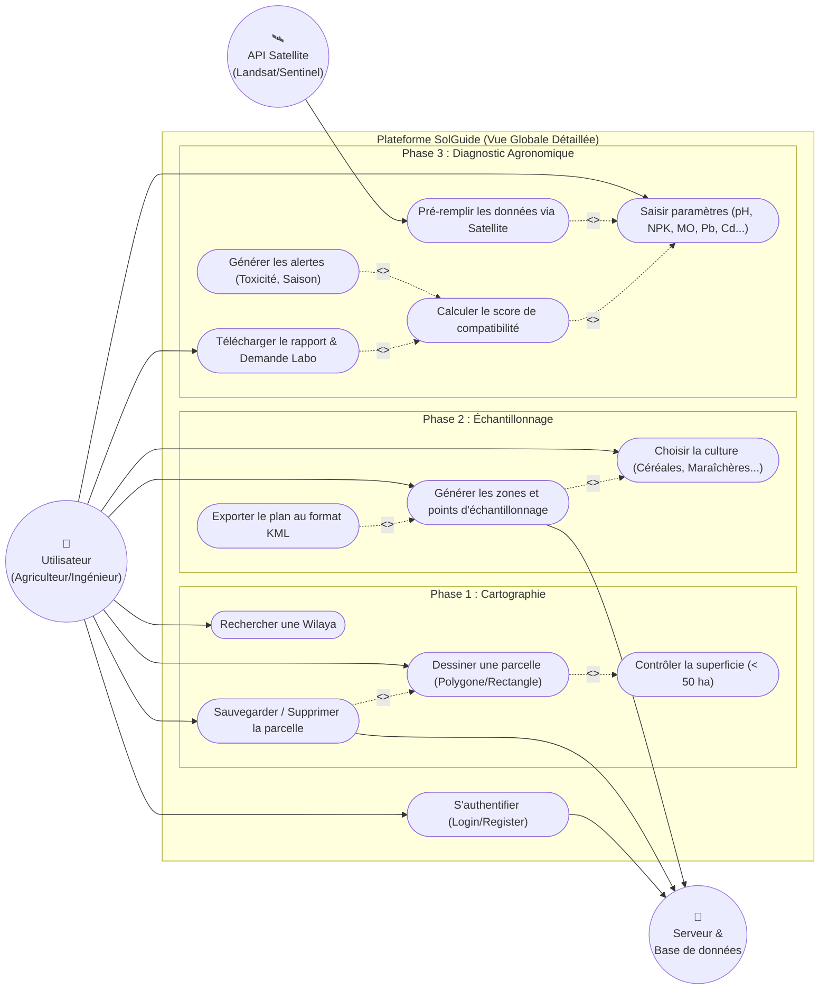
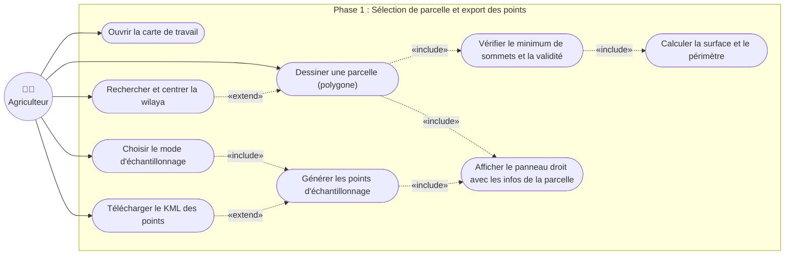
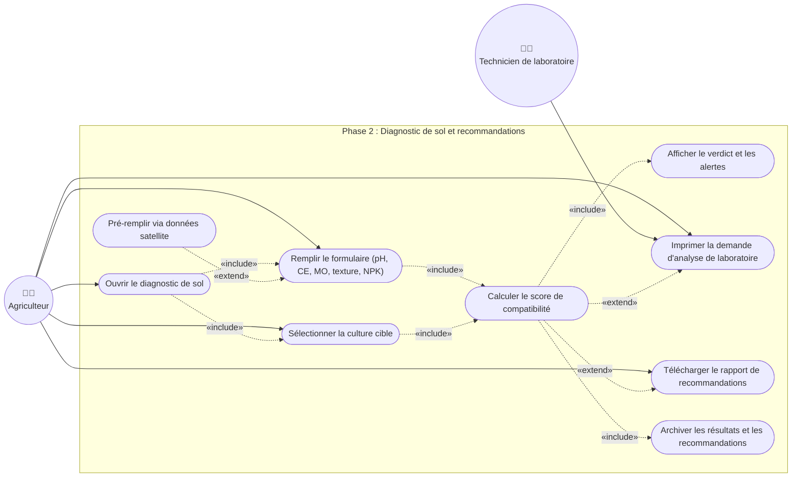

## 1) Global Use Case Diagram

```mermaid
flowchart LR
    %% Acteurs
    User(("👤\nUtilisateur\n(Agriculteur/Ingénieur)"))
    SatAPI(("🛰️\nAPI Satellite\n(Landsat/Sentinel)"))
    Backend(("💾\nServeur &\nBase de données"))

    %% Frontière du Système
    subgraph SolGuide ["Plateforme SolGuide (Vue Globale Détaillée)"]
        direction TB
        
        Auth(["S'authentifier (Login/Register)"])
        
        subgraph Carto ["Phase 1 : Cartographie"]
            Wilaya(["Rechercher une Wilaya"])
            Draw(["Dessiner une parcelle (Polygone/Rectangle)"])
            CheckArea(["Contrôler la superficie (< 50 ha)"])
            Manage(["Sauvegarder / Supprimer la parcelle"])
        end

        subgraph Echant ["Phase 2 : Échantillonnage"]
            Crop(["Choisir la culture (Céréales, Maraîchères...)"])
            GenPoints(["Générer les zones et points d'échantillonnage"])
            KML(["Exporter le plan au format KML"])
        end

        subgraph Diag ["Phase 3 : Diagnostic Agronomique"]
            SatData(["Pré-remplir les données via Satellite"])
            FillForm(["Saisir paramètres (pH, NPK, MO, Pb, Cd...)"])
            Score(["Calculer le score de compatibilité"])
            Alerts(["Générer les alertes (Toxicité, Saison)"])
            Reports(["Télécharger le rapport & Demande Labo"])
        end
    end

    %% Connexions Acteur Principal -> Système
    User --> Auth
    User --> Wilaya
    User --> Draw
    User --> Manage
    User --> Crop
    User --> GenPoints
    User --> FillForm
    User --> Reports

    %% Relations Cartographie
    Draw -. "<<include>>" .-> CheckArea
    Manage -. "<<extend>>" .-> Draw
    
    %% Relations Échantillonnage
    GenPoints -. "<<include>>" .-> Crop
    KML -. "<<extend>>" .-> GenPoints

    %% Relations Diagnostic
    SatData -. "<<extend>>" .-> FillForm
    Score -. "<<include>>" .-> FillForm
    Alerts -. "<<extend>>" .-> Score
    Reports -. "<<extend>>" .-> Score

    %% Connexions Acteurs Secondaires (Systèmes)
    SatAPI --> SatData
    Manage --> Backend
    Auth --> Backend
    GenPoints --> Backend
```

## 2) Phase 1 Use Case Diagram: Parcel Selection and Sampling

```mermaid
flowchart LR
  Farmer(("🧑‍🌾\nAgriculteur"))

  subgraph "Phase 1 : Sélection de parcelle et export des points"
    direction TB
    OpenMap(["Ouvrir la carte de travail"])
    SelectWilaya(["Rechercher et centrer la wilaya"])
    DrawParcel(["Dessiner une parcelle (polygone)"])
    CheckGeometry(["Vérifier le minimum de sommets et la validité"])
    CalcArea(["Calculer la surface et le périmètre"])
    ChooseMode(["Choisir le mode d'échantillonnage"])
    GeneratePoints(["Générer les points d'échantillonnage"])
    ShowRightPanel(["Afficher le panneau droit avec les infos de la parcelle"])
    ExportKML(["Télécharger le KML des points"])
  end

  Farmer --> OpenMap
  Farmer --> SelectWilaya
  Farmer --> DrawParcel
  Farmer --> ChooseMode
  Farmer --> ExportKML

  DrawParcel -. "«include»" .-> CheckGeometry
  CheckGeometry -. "«include»" .-> CalcArea
  DrawParcel -. "«include»" .-> ShowRightPanel
  ChooseMode -. "«include»" .-> GeneratePoints
  GeneratePoints -. "«include»" .-> ShowRightPanel
  ExportKML -. "«extend»" .-> GeneratePoints
  SelectWilaya -. "«extend»" .-> DrawParcel
```

## 3) Phase 2 Use Case Diagram: Diagnostic, Recommendations and Laboratory Outputs

```mermaid
flowchart LR
  Farmer(("🧑‍🌾\nAgriculteur"))
  Technician(("🧑‍🔬\nTechnicien de laboratoire"))

  subgraph "Phase 2 : Diagnostic de sol et recommandations"
    direction TB
    OpenDiag(["Ouvrir le diagnostic de sol"])
    Preload(["Pré-remplir via données satellite"])
    FillForm(["Remplir le formulaire (pH, CE, MO, texture, NPK)"])
    LoadCrop(["Sélectionner la culture cible"])
    ComputeScore(["Calculer le score de compatibilité"])
    ShowVerdict(["Afficher le verdict et les alertes"])
    PrintLab(["Imprimer la demande d'analyse de laboratoire"])
    DownloadReport(["Télécharger le rapport de recommandations"])
    SaveHistory(["Archiver les résultats et les recommandations"])
  end

  Farmer --> OpenDiag
  Farmer --> FillForm
  Farmer --> LoadCrop
  Farmer --> PrintLab
  Farmer --> DownloadReport
  Technician --> PrintLab

  OpenDiag -. "«include»" .-> FillForm
  OpenDiag -. "«include»" .-> LoadCrop
  Preload -. "«extend»" .-> FillForm
  FillForm -. "«include»" .-> ComputeScore
  LoadCrop -. "«include»" .-> ComputeScore
  ComputeScore -. "«include»" .-> ShowVerdict
  ComputeScore -. "«extend»" .-> PrintLab
  ComputeScore -. "«extend»" .-> DownloadReport
  ComputeScore -. "«include»" .-> SaveHistory
```